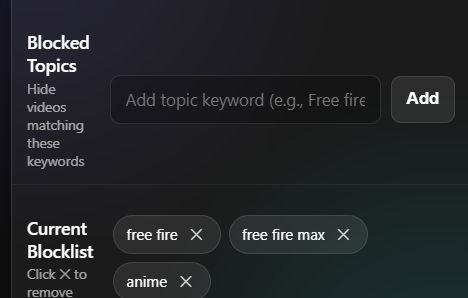
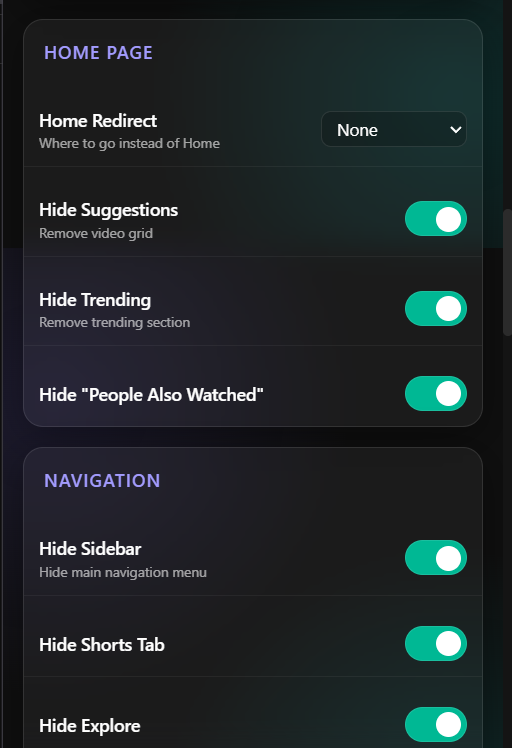
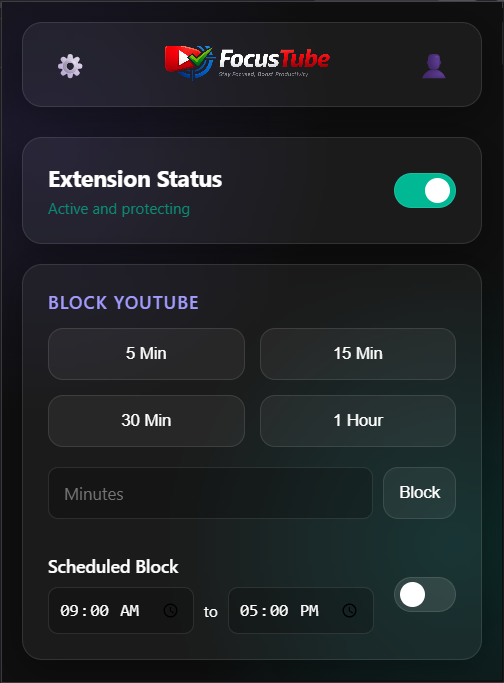
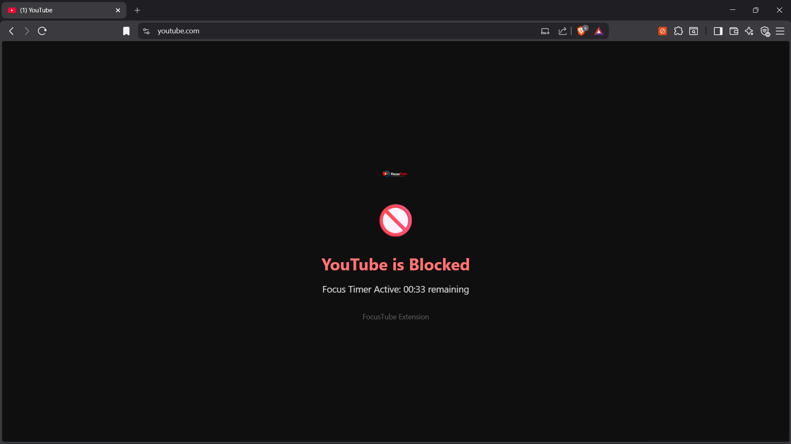
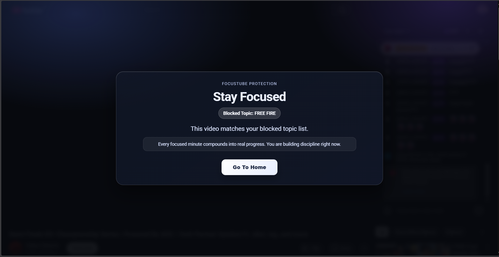
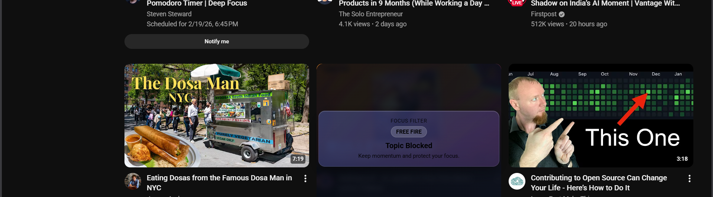

# FocusTube - Productivity & Distraction Control

A comprehensive Chrome extension that takes control of your YouTube experience, reduces distractions, and boosts productivity.

## 🎯 Core Objective

Reduce distractions, improve focus, and give users full control over YouTube's interface, ads, and playback behavior without breaking core functionality.

## ✨ Features

### 🎥 Video Page Features

- **AI Summary Button** - Get AI-powered summaries of video content (mock API included, easy to integrate real LLM)
- **Hide All Shorts** - Remove Shorts shelves, tabs, and videos from all pages
- **Hide Banner Ads** - Remove top banners, sidebar ads, and promoted videos
- **Skip Video Ads** - Automatically click "Skip Ad" when available, with mute/speed fallback
- **Disable Autoplay** - Force autoplay OFF even if YouTube tries to enable it
- **Force Video Quality** - Default to highest available quality automatically
- **Native HTML5 Player** - Option to use browser controls instead of YouTube's custom UI

### 📸 Feature Screenshots

Blocklist (beta) and focused browsing:




Time blocking UI and overlay:




New Time Blocker Screens:




### 🏠 Home Page Features

- **Hide Suggestions** - Remove recommended videos and "People also watched"
- **Hide Trending** - Remove trending sections from homepage
- **Home Page Redirect** - Set default landing page to:
  - Default Home
  - Subscriptions
  - Search
  - Minimal/Focus Page

### 🧭 Navigation Controls

Toggle visibility of navigation items:
- Shorts
- Explore
- Gaming
- Trending

### 🔔 Header Controls

Hide header elements:
- Notifications
- Create button
- Voice search

## 📁 Folder Structure

```
youtube-focus-pro/
├── manifest.json                          # Extension manifest (Manifest V3)
├── README.md                             # This file
│
├── src/
│   ├── content/                          # Content scripts
│   │   ├── content.js                    # Main coordinator
│   │   ├── content.css                   # Styles for injected UI
│   │   ├── storage.js                    # Storage utilities
│   │   ├── dom-helpers.js               # DOM manipulation helpers
│   │   ├── ad-blocker.js                # Banner ad & video ad blocking
│   │   ├── shorts-blocker.js            # Shorts removal
│   │   ├── autoplay-controller.js         # Autoplay control
│   │   ├── quality-controller.js         # Video quality control
│   │   ├── home-controller.js            # Home page & redirect
│   │   ├── navigation-controller.js      # Navigation bar controls
│   │   ├── header-controller.js          # Header element controls
│   │   ├── summary-button.js            # AI Summary button
│   │   └── video-player-controller.js   # Native player toggle
│   │
│   ├── background/                       # Background service worker
│   │   └── background.js               # Main background script
│   │
│   ├── popup/                           # Settings popup
│   │   ├── popup.html                  # Settings UI
│   │   ├── popup.css                   # Settings styles
│   │   └── popup.js                    # Settings logic
│   │
│   └── icons/                           # Extension icons
│       ├── icon16.svg
│       ├── icon48.svg
│       └── icon128.svg
```

## 🚀 Installation

### Option 1: Load Unpacked (Development)

1. Clone or download this repository
2. Open Chrome and navigate to `chrome://extensions/`
3. Enable **Developer Mode** (top-right toggle)
4. Click **"Load unpacked"**
5. Select the project folder containing `manifest.json`
6. Extension is now active!

### Option 2: Package & Install

1. Navigate to `chrome://extensions/`
2. Enable **Developer Mode**
3. Click **"Pack extension"**
4. Select the project folder
5. Chrome will generate a `.crx` file that can be distributed

## ⚙️ Usage

### Accessing Settings

1. Click the extension icon in Chrome's toolbar
2. The settings panel will appear with organized sections
3. Toggle features on/off as needed
4. Changes are saved automatically and synced across devices

### Feature Sections

#### Video Page
- Controls features on video watch pages
- Toggle summary button, ad skipping, autoplay, quality, etc.

#### Shorts & Ads
- Global settings for Shorts and ad blocking
- Applies to all pages

#### Home Page
- Customize homepage appearance
- Set default landing page

#### Navigation
- Control left sidebar items
- Hide distractions from navigation

#### Header
- Control top header elements
- Reduce notification distractions

## 🧠 Implementing Real AI Summary

The current implementation includes a mock summary generator. To implement real AI summaries:

1. Open `src/content/summary-button.js`
2. Find the `generateSummary()` function
3. Replace the mock code with your LLM API call:

```javascript
async function generateSummary(videoData) {
  try {
    const response = await fetch('YOUR_API_ENDPOINT', {
      method: 'POST',
      headers: { 
        'Content-Type': 'application/json',
        'Authorization': 'Bearer YOUR_API_KEY'
      },
      body: JSON.stringify({
        title: videoData.title,
        description: videoData.description,
        videoId: videoData.videoId
      })
    });

    const data = await response.json();
    return data.summary;
  } catch (error) {
    console.error('[YFP] Error calling AI API:', error);
    // Fallback to mock summary
    return generateMockSummary(videoData);
  }
}
```

4. Update the response format in `showSummaryModal()` as needed

## 🔧 Technical Details

### Key Technologies

- **Manifest V3** - Latest Chrome extension API
- **Content Scripts** - Direct DOM manipulation on YouTube pages
- **MutationObserver** - Watch for dynamic DOM changes
- **Chrome Storage API** - Persistent settings synced across devices
- **Service Worker** - Background tasks and message handling

### Safe DOM Manipulation

All modules use:
- Safe selector functions with error handling
- Graceful fallbacks when elements don't exist
- Debouncing for performance optimization
- No deprecated Chrome APIs

### MutationObserver Pattern

```javascript
const observer = new MutationObserver(debounce(() => {
  // Apply features
  if (settings.hideShorts) {
    removeShorts();
  }
}, 200));

observer.observe(document.body, {
  childList: true,
  subtree: true
});
```

This pattern ensures features are re-applied when YouTube updates the DOM dynamically.

### Module Communication

- **Popup → Content Script**: Via `chrome.tabs.sendMessage()`
- **Background → Content Script**: Automatic on storage changes
- **Content Script → Background**: Via `chrome.runtime.sendMessage()`

## ⚠️ Important Notes

### Ad Blocking Warning

The video ad skipper with mute/speed fallback may trigger YouTube's ad-block detection. Use at your own risk.

### Native HTML5 Player

This feature disables YouTube's custom UI and uses browser controls:
- Some YouTube features won't work (annotations, cards, etc.)
- YouTube may update and block this feature in the future

### Performance

The extension is designed for minimal performance impact:
- Debounced operations to prevent excessive processing
- Efficient MutationObserver usage
- Selective DOM queries

## 🔄 Updates & Maintenance

YouTube frequently updates its DOM structure. The extension includes:

- Multiple selector patterns for each feature
- Graceful fallbacks for missing elements
- Automatic re-application on DOM changes
- Periodic maintenance checks

If features stop working:
1. Refresh the page
2. Check Chrome console for `[YFP]` logs
3. Report issues with URL and error details

## 📝 Development

### Modifying Features

Each feature is in its own module in `src/content/`:
1. Edit the relevant module file
2. Reload the extension in `chrome://extensions/`
3. Refresh YouTube to test changes

### Adding New Features

1. Create a new module in `src/content/`
2. Initialize it in `src/content/content.js`
3. Add settings to `DEFAULT_SETTINGS` in relevant files
4. Add UI controls in `src/popup/popup.html`
5. Handle settings in `src/popup/popup.js`

### Debugging

Open Chrome DevTools on YouTube (F12) and look for:
- `[YFP]` prefixed console logs
- Any red error messages
- MutationObserver activity

## 📄 License

This is an educational project. YouTube's terms of service should be respected when using extensions.

## 🤝 Contributing

Contributions are welcome! Areas for improvement:
- Better AI summary integration
- Additional content filtering options
- Scheduled blocking implementation
- Password protection for settings
- Enhanced performance optimizations

## 🙏 Acknowledgments

Built with:
- Manifest V3 Chrome Extension API
- Modern JavaScript (ES6+)
- YouTube's DOM patterns (subject to change)

---

**Note**: This extension modifies YouTube's UI and behavior. Use responsibly and in compliance with YouTube's terms of service.
